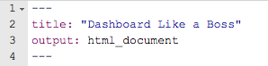
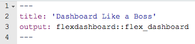
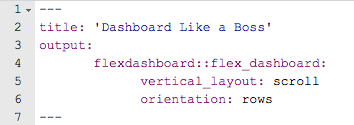

```{r setup, include=FALSE,warning=FALSE,message=FALSE}

# setup for all chunks
knitr::opts_chunk$set(echo = FALSE)

# packages
library(DT)
library(highcharter)
library(lubridate)
library(RMySQL)
library(summarytools)
library(tidyverse)

```


```{css}

.gdbar img {
  width: 253px !important;
  height: 79px !important;
  margin: 8px 8px;
}

.gdbar {
  width: 400px !important;
  height: 95px !important;
}

.footer {
    position: fixed;
    left: 0;
    bottom: 0;
    width: 100%;
    margin: 5px;
   
    text-align: right;
}

slides > slide:not(.nobackground):before {
  width: 75px;
  height: 25px;
  background-size: 75px 25px;
}

```


1. título, redes de parcerias estabelecidas. 2-3. andamento. 4. Produtos esperados e datas de entrega dos mesmos. 5. gargalos que precisam ser resolvidos para funcionar melhor)

# Atualizações...

## Atualizações | Laboratório {.flexbox .vleft}

<h3>Volta ao trabalho presencial!</h3>
</br>
</br>

- Organização pós pandemia

- Instalação de experimento a longo prazo (8 dias/mês)

- Treinamento de pessoal (graduação, pós)

- *Já ouviu a palavra do Hadley hoje?*

- Interação


## Atualizações | Pesquisa {.flexbox .vcenter}

> - Dados de anfíbios e répteis coletados

> - Função para coleta de dados no BOLD Systems ok

> - 8 dias/mês

> - Treinamento de pessoal (graduação, pós)


## How to DLAB? | A 12 Step Program to Quit Emailing Plots & Csvs

1. Basic Layout
2. Printing: Tables,Descriptice Stats, Model summaries
3. Interactive Datasets
4. Interactive Plots
5. Exporting
6. CSS basics
7. Branding (Logos,  font, colors)
8. Header/Footer
9. Hosting
10. Automate-ish (render + system())
11. Replicate (render with arguments)
12. Automate or App it (cron, shiny runtime) 


## Dashboard? | Melhorando a forma de comunicação

 
<h5>1\. Dados gerais</h5>
<h5>2\. Gráficos</h5>
<h5>3\. Interactive Datasets</h5>
<h5>4\. Tabelas</h5>
<h5>5\. Exportando</h5>


# 1. Basic Layout
<3 flexdashboard <3

## .Rmd + flexdashboard 
 
### Before :(
 

```{r,out.width = "400px"}

``` 

### After :)
 
```{r,out.width = "400px"}

``` 


## flexdashboard layouts

### My go-to

```{r,out.width = "500px"}

```

*optional*: </br>

 + vertical_layout: \{scroll, fill\}

 + orientation: \{columns, rows\}

 
#  | print() is simply unacceptable
# 2. Printing Tables, Descriptive Stats & Model Summaries 


##   Tables, Descriptive Stats & Model Summaries

<center>
<h3>printr
</br>
</br>
summarytools::dfSummary
</br>
</br>
stargazer::stargazer</h3>
</center>

##   Table Printing: my go-to 

</br>
</br>
<h3> tables & descriptive stats:  **printr** </h3>
</br>
</br>
<h3> model summaries: **stargazer::stargazer** </h3>
</br>


##  Model Summary & Comparisons | stargazer::stargazer

Which model summary statistics do you wantto include in the output? Bookmark the link for later

https://rdrr.io/cran/stargazer/man/stargazer_stat_code_list.html

# 3. Interactive Datasets 

##  Interactive Datasets 

<center>


<h3>DT::datatable</h3>
</center>


## Datasets | DT::datatable 

* pretty printing

* flexible formatting

* column filtering

* csv download

* cell highlighting (think heatmap)


# 4. Interactive plots | We're not in PowerPoint anymore.

##  4. Interactive plots 
<center>
<h3>highcharter</h3></center>

</br>
</br>
</br>
</br>
</br>
ggplot2 will always have a place in your heart, but dashboards need more than pngs

##  4. Interactive plots 
<center>
<h3>highcharter</h3></center>

</br>
</br>
</br>
</br>
</br>
</br>
Other options
       
* *Maps*:    &nbsp;&nbsp;&nbsp;&nbsp;&nbsp;&nbsp;&nbsp;&nbsp;&nbsp;&nbsp;&nbsp;&nbsp;&nbsp;&nbsp;&nbsp;&nbsp;&nbsp;&nbsp;&nbsp;&nbsp;&nbsp;&nbsp;&nbsp;&nbsp;&nbsp;&nbsp;&nbsp;&nbsp;            leaflet 
* *Timeseries*:   &nbsp;&nbsp;&nbsp;&nbsp;&nbsp;&nbsp;&nbsp;&nbsp;&nbsp;&nbsp;&nbsp;&nbsp;&nbsp;&nbsp;&nbsp;&nbsp;&nbsp;&nbsp;&nbsp;       dygraphs
* *ggplot2 compatible*: &nbsp;&nbsp;&nbsp;&nbsp; plotly


# 4. Exporting 

## Exporting 

* Datasets with DT

* Highcharter Plots


## Dashboard LIKE A BOSS: pro tips | Let your dashboard work for you

SIMPLE 

> - Start with a simple template & someone else's css 
> - Add in the essentials or the lowest hanging fruit as you go

ORGANIZED

> - *Maintain a folder* containing: css, exporting scripts, color palletes, global themes, & templates
> - Keep a staging folder for exploration--*don't make changes you won't know how to undo*.
> - Keep expensive data cleaning in a separate script (easier to introduce it later than remove it after)

EXPLORE 

> - Try something new (template, plots, or css) to improve the appearance & usability of each new dashboard
> - Slowly work in:  About page & explanations,  interactive viz, exporting, logo, footer, padding/margins


## Onde me encontrar: | github.com/rsilveirafh
<small> <div class="columns-2"> 
1. Blog: 
    + <a href="https://rsilveirafh.netlify.app/about.html">https://rsilveirafh.netlify.app/</a> 
2. CV: 
    + All: <a href="https://github.com/rsilveirafh/blogR/blob/6013efef2292427bfbead7f12d6dcff443c1be08/Curriculum-Vitae-RRdSF.pdf">CV</a> 
3. LinkedIn:
    + <a href="https://www.linkedin.com/in/rsilveirafh/">https://www.linkedin.com/in/rsilveirafh/</a>
4. E-mail
    + <a href="mailto:ricardodasilveira@gmail.com">ricardodasilveira@gmail.com</a>
</small>